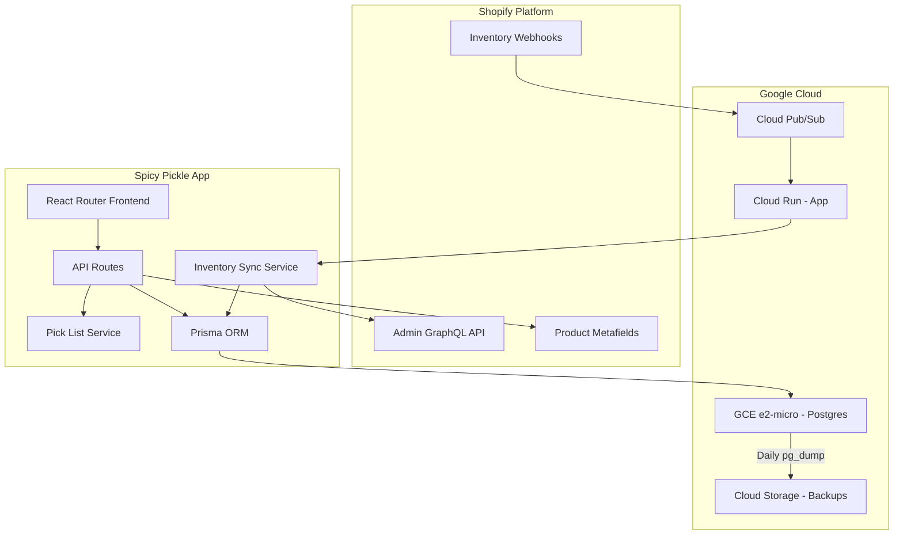

# Spicy Pickle App Development Plan

## Google Cloud Project

| Property | Value |
|----------|-------|
| Project ID | `spicy-pickle-484622` |
| Project Number | `990586804218` |
| Region | `australia-southeast1` (Sydney) |

**Region rationale**: Shopify stores data globally (not localized to Oceania), so webhook latency from Shopify is similar regardless of hosting location. Sydney hosting optimizes for:
- Staff using the app UI (pick lists, bundle config) from NZ/AU
- App → Shopify API call latency for inventory updates
- Data residency closer to your business operations

---

## Business Summary

Spicy Pickle is a Shopify app that combines two core functionalities:

1. **Bundle Inventory Sync**: Manages a shared inventory pool where multiple product variants (e.g., Single, 4-Pack, 6-Pack, 24-Pack) derive their availability from a base physical unit count. When any variant sells, the physical stock decreases and all related variants recalculate their availability.

2. **Pick List Generator**: Aggregates orders into a consolidated picking list, grouping by product variant with quantities and bin locations. Bundles can be optionally expanded to their base components for picking.

---

## Architecture Overview



---

## Infrastructure

### Database: Self-Hosted PostgreSQL on GCE

**Cost: ~$1.70/month** (10GB SSD disk only; e2-micro VM is free tier)

| Component | Specification | Cost |
|-----------|---------------|------|
| VM | e2-micro (0.25 vCPU, 1GB RAM) | Free (1 per billing account) |
| Disk | 10GB SSD persistent | ~$1.70/mo |
| Backups | Cloud Storage (pg_dump) | ~$0.02/GB/mo |

**Setup:**
- Docker Compose with official `postgres:16-alpine` image
- Persistent volume mounted to `/var/lib/postgresql/data`
- Private IP within VPC for Cloud Run access
- Daily cron job for `pg_dump` to Cloud Storage

**Migration Path:** When scaling needs grow, export via `pg_dump` and import to Cloud SQL.

### Compute: Cloud Run

- Spicy Pickle app deployed as container
- Auto-scales to zero when idle
- Connects to GCE Postgres via VPC connector

### Queue: Google Cloud Pub/Sub

- Receives Shopify inventory webhooks
- Push subscription to Cloud Run endpoint
- Handles burst traffic (600+ inventory changes)

---

## Database Schema

Extend the existing Prisma schema in `prisma/schema.prisma`:

```prisma
generator client {
  provider = "prisma-client-js"
}

datasource db {
  provider = "postgresql"
  url      = env("DATABASE_URL")
}

model Session {
  id            String    @id
  shop          String
  state         String
  isOnline      Boolean   @default(false)
  scope         String?
  expires       DateTime?
  accessToken   String
  userId        BigInt?
  firstName     String?
  lastName      String?
  email         String?
  accountOwner  Boolean   @default(false)
  locale        String?
  collaborator  Boolean?  @default(false)
  emailVerified Boolean?  @default(false)
  refreshToken        String?
  refreshTokenExpires DateTime?
}

model Shop {
  id           String        @id // shop domain (e.g., "my-store.myshopify.com")
  createdAt    DateTime      @default(now())
  bundles      Bundle[]
  binLocations BinLocation[]
}

model Bundle {
  id           String        @id @default(cuid())
  shopId       String
  shop         Shop          @relation(fields: [shopId], references: [id])
  name         String
  parentGid    String        // Shopify Product Variant GID
  createdAt    DateTime      @default(now())
  updatedAt    DateTime      @updatedAt
  children     BundleChild[]
  expandOnPick Boolean       @default(false)
  
  @@unique([shopId, parentGid])
  @@index([shopId])
}

model BundleChild {
  id       String @id @default(cuid())
  bundleId String
  bundle   Bundle @relation(fields: [bundleId], references: [id], onDelete: Cascade)
  childGid String // Shopify Product Variant GID
  quantity Int    // Multiplier (e.g., 24 for 24-pack)
  
  @@unique([bundleId, childGid])
}

model BinLocation {
  id         String @id @default(cuid())
  shopId     String
  shop       Shop   @relation(fields: [shopId], references: [id])
  variantGid String // Shopify Product Variant GID
  location   String // Free-form bin location string
  
  @@unique([shopId, variantGid])
  @@index([shopId])
}

// Sync state for idempotency during inventory updates
model SyncLock {
  id         String   @id // webhook event ID or bundle sync ID
  bundleId   String
  createdAt  DateTime @default(now())
  expiresAt  DateTime // Auto-cleanup after TTL
  
  @@index([bundleId])
  @@index([expiresAt])
}
```

---

## Phase 0: Developer Tooling and Quality Gates

This phase establishes code quality infrastructure that runs throughout development and protects post-v1 changes.

### 0.1 TypeScript Strict Type Checking

The existing `tsconfig.json` already has `"strict": true`. Enhance with additional checks:

```json
{
  "compilerOptions": {
    "strict": true,
    "noUncheckedIndexedAccess": true,
    "noImplicitReturns": true,
    "noFallthroughCasesInSwitch": true,
    "exactOptionalPropertyTypes": true
  }
}
```

### 0.2 ESLint Type-Aware Linting

Update `.eslintrc.cjs` to enable type-aware rules:

```javascript
// In the TypeScript override section:
{
  files: ["**/*.{ts,tsx}"],
  parserOptions: {
    project: "./tsconfig.json",
    tsconfigRootDir: __dirname,
  },
  extends: [
    "plugin:@typescript-eslint/recommended",
    "plugin:@typescript-eslint/recommended-requiring-type-checking", // Add this
    "plugin:import/recommended",
    "plugin:import/typescript",
  ],
  rules: {
    "@typescript-eslint/no-floating-promises": "error",
    "@typescript-eslint/no-misused-promises": "error",
    "@typescript-eslint/await-thenable": "error",
    "@typescript-eslint/no-unnecessary-type-assertion": "warn",
  },
}
```

### 0.3 Pre-Commit Hooks with Husky and lint-staged

Install and configure:

```bash
npm install -D husky lint-staged
npx husky init
```

Create `.husky/pre-commit`:

```bash
npx lint-staged
```

Add to `package.json`:

```json
{
  "lint-staged": {
    "*.{ts,tsx}": [
      "eslint --fix",
      "prettier --write"
    ],
    "*.{json,md,css}": [
      "prettier --write"
    ]
  }
}
```

### 0.4 Testing Framework with Vitest

Install Vitest (compatible with Vite):

```bash
npm install -D vitest @testing-library/react @testing-library/dom jsdom
```

Create `vitest.config.ts`:

```typescript
import { defineConfig } from "vitest/config";
import tsconfigPaths from "vite-tsconfig-paths";

export default defineConfig({
  plugins: [tsconfigPaths()],
  test: {
    environment: "jsdom",
    globals: true,
    include: ["app/**/*.test.{ts,tsx}", "tests/**/*.test.{ts,tsx}"],
    coverage: {
      provider: "v8",
      reporter: ["text", "html"],
      include: ["app/services/**/*.ts"],
    },
  },
});
```

Add scripts to `package.json`:

```json
{
  "scripts": {
    "test": "vitest run",
    "test:watch": "vitest",
    "test:coverage": "vitest run --coverage"
  }
}
```

### 0.5 Pre-Push Hook for Full Validation

Create `.husky/pre-push`:

```bash
npm run typecheck
npm run test
```

### 0.6 CI/CD Quality Gates (Future)

For GitHub Actions or Cloud Build:

```yaml
# .github/workflows/ci.yml
name: CI
on: [push, pull_request]
jobs:
  validate:
    runs-on: ubuntu-latest
    steps:
      - uses: actions/checkout@v4
      - uses: actions/setup-node@v4
        with:
          node-version: "22"
          cache: "npm"
      - run: npm ci
      - run: npm run typecheck
      - run: npm run lint
      - run: npm run test
```

### 0.7 Key Test Files to Create

| File | Purpose |
|------|---------|
| `app/services/inventory-sync.server.test.ts` | Unit tests for sync algorithm |
| `app/services/picklist.server.test.ts` | Unit tests for pick list generation |
| `tests/integration/bundle-crud.test.ts` | Integration tests for bundle CRUD |

### 0.8 Scripts Summary

| Script | When to Run | Purpose |
|--------|-------------|---------|
| `npm run lint` | Pre-commit (auto) | ESLint with type checking |
| `npm run typecheck` | Pre-push (auto) | Full TypeScript validation |
| `npm run test` | Pre-push (auto) | Run all tests |
| `npm run test:watch` | During development | Watch mode for TDD |
| `npm run test:coverage` | Before release | Verify coverage targets |

---

## Phase 1: Core Infrastructure

### 1.1 GCE Postgres Setup
- Create `infrastructure/docker-compose.yml` for Postgres container
- Create `infrastructure/backup.sh` script for pg_dump to Cloud Storage
- Document GCE VM setup in `infrastructure/README.md`

### 1.2 Database Migration
- Update `prisma/schema.prisma` to use PostgreSQL
- Add Shop, Bundle, BundleChild, BinLocation, SyncLock models
- Create migration scripts

### 1.3 Shopify App Configuration
Update `shopify.app.toml` with required scopes:
- `read_products`, `write_products`
- `read_inventory`, `write_inventory`  
- `read_orders`

### 1.4 Webhook Infrastructure
- Add `INVENTORY_LEVELS/UPDATE` webhook subscription
- Create webhook handler route at `app/routes/webhooks.inventory.tsx`
- Set up Google Cloud Pub/Sub topic and push subscription

---

## Phase 2: Bundle Configuration UI

### 2.1 Bundle Management Pages
| Route | Purpose |
|-------|---------|
| `app/routes/app.bundles._index.tsx` | List all bundles with search/filter |
| `app/routes/app.bundles.new.tsx` | Create new bundle |
| `app/routes/app.bundles.$id.tsx` | Edit existing bundle |

### 2.2 Bundle Configuration Components
- Product/Variant picker using Shopify Resource Picker
- Child variant list with quantity inputs
- "Expand on pick" toggle per bundle
- Delete bundle functionality

### 2.3 CSV Import/Export
| Route | Purpose |
|-------|---------|
| `app/routes/app.bundles.import.tsx` | CSV upload for bulk bundle creation |
| `app/routes/app.bundles.export.tsx` | CSV download of current configuration |

CSV format: `parent_gid,child_gid,quantity,expand_on_pick`

---

## Phase 3: Inventory Sync Engine

### 3.1 Sync Logic Service

Create `app/services/inventory-sync.server.ts`:

```typescript
// Core algorithm for same-product bundles (e.g., Single/4-Pack/24-Pack):
// 1. Receive inventory change webhook
// 2. Look up all bundles containing the changed variant
// 3. Find the "base" variant (quantity=1 child) to get physical unit count
// 4. For each sibling variant: new_availability = floor(physical_units / multiplier)
// 5. Batch update all affected variants via GraphQL inventoryAdjustQuantities

// For mixed bundles (variety packs with different products):
// Availability = min(child_stock / child_quantity) across all children
```

### 3.2 Idempotency and Loop Prevention

Using the `SyncLock` table:
- Before processing, check if lock exists for this webhook event ID
- If lock exists and not expired, skip (already processed)
- If no lock, create lock with TTL, process, then delete
- Prevents infinite loops from our own inventory updates

### 3.3 Pub/Sub Integration
- Configure push subscription to `/webhooks/inventory/pubsub`
- Implement acknowledgment and retry logic
- Add exponential backoff for failed syncs

---

## Phase 4: Pick List Generator

### 4.1 Bin Location Management
| Route | Purpose |
|-------|---------|
| `app/routes/app.locations._index.tsx` | List/edit bin locations |
| `app/routes/app.locations.import.tsx` | CSV import for bin locations |

CSV format: `variant_gid,variant_sku,bin_location`

### 4.2 Pick List Generation UI

Create `app/routes/app.picklist._index.tsx`:
- Date range filter for orders
- Order status filter (unfulfilled, partially fulfilled)
- Manual order selection option
- Generate button

### 4.3 Pick List Processing

Create `app/services/picklist.server.ts`:

```typescript
// Algorithm:
// 1. Fetch selected orders with line items via GraphQL
// 2. For each line item:
//    - Check if variant has bundle with expandOnPick=true
//    - If yes, replace with (child variants × child quantities × line item quantity)
//    - If no, keep as-is
// 3. Aggregate all variants, sum quantities
// 4. Join with bin locations from database
// 5. Return sorted by bin location for efficient warehouse picking
```

### 4.4 Pick List Output
- Table view with columns: Product | Variant | Quantity | Bin Location
- Sort options: by bin location (default), by product, by quantity
- Print-friendly CSS view
- CSV export button

---

## Phase 5: API and Metafield Integration

### 5.1 Metafield Storage
Store bundle configuration in product metafields for external automation access:
- Namespace: `spicy_pickle`
- Key: `bundle_config` (JSON with children and quantities)
- Key: `bin_location` (string)

### 5.2 Future REST API Endpoints
For external integrations:
- `GET /api/bundles` - List bundles
- `POST /api/bundles` - Create bundle
- `PUT /api/bundles/:id` - Update bundle
- `DELETE /api/bundles/:id` - Delete bundle

---

## Key Files to Create/Modify

| File | Purpose |
|------|---------|
| `tsconfig.json` | Add strict type checking options |
| `.eslintrc.cjs` | Add type-aware linting rules |
| `.husky/pre-commit` | Run lint-staged on commit |
| `.husky/pre-push` | Run typecheck and tests on push |
| `vitest.config.ts` | Test framework configuration |
| `prisma/schema.prisma` | Add Shop, Bundle, BundleChild, BinLocation, SyncLock models |
| `shopify.app.toml` | Add inventory/order scopes and webhooks |
| `infrastructure/docker-compose.yml` | Postgres container config |
| `infrastructure/backup.sh` | Database backup script |
| `app/services/inventory-sync.server.ts` | Core inventory sync logic |
| `app/services/inventory-sync.server.test.ts` | Unit tests for sync algorithm |
| `app/services/picklist.server.ts` | Pick list generation logic |
| `app/services/picklist.server.test.ts` | Unit tests for pick list |
| `app/routes/app.bundles._index.tsx` | Bundle list page |
| `app/routes/app.bundles.new.tsx` | Create bundle page |
| `app/routes/app.bundles.$id.tsx` | Edit bundle page |
| `app/routes/app.locations._index.tsx` | Bin locations page |
| `app/routes/app.picklist._index.tsx` | Pick list generator page |
| `app/routes/webhooks.inventory.tsx` | Inventory webhook handler |

---

## Tech Stack Summary

| Layer | Technology |
|-------|------------|
| Frontend | React Router v7, Shopify Polaris, App Bridge React |
| Backend | React Router server routes, Prisma ORM |
| Database | PostgreSQL 16 (self-hosted on GCE e2-micro) |
| Queue | Google Cloud Pub/Sub |
| Hosting | Google Cloud Run |
| API | Shopify Admin GraphQL API (2026-04) |

---

## Estimated Monthly Costs

| Service | Cost |
|---------|------|
| GCE e2-micro VM | Free (free tier) |
| 10GB SSD Persistent Disk | ~$1.70 |
| Cloud Storage (backups) | ~$0.05 |
| Cloud Run | ~$0-5 (scales to zero) |
| Cloud Pub/Sub | ~$0-1 (low volume) |
| **Total** | **~$2-8/month** |

---

## Development Phases

- [ ] **Phase 0**: Developer tooling (TypeScript strict, ESLint type-aware, Husky, Vitest)
- [ ] **Phase 1**: Infrastructure setup (GCE Postgres, Prisma schema, webhooks)
- [ ] **Phase 2**: Bundle configuration UI (CRUD pages, Resource Picker, CSV)
- [ ] **Phase 3**: Inventory sync engine (sync logic, Pub/Sub, idempotency)
- [ ] **Phase 4**: Pick list generator (order selection, bin locations, output)
- [ ] **Phase 5**: API/Metafield integration (external access)
